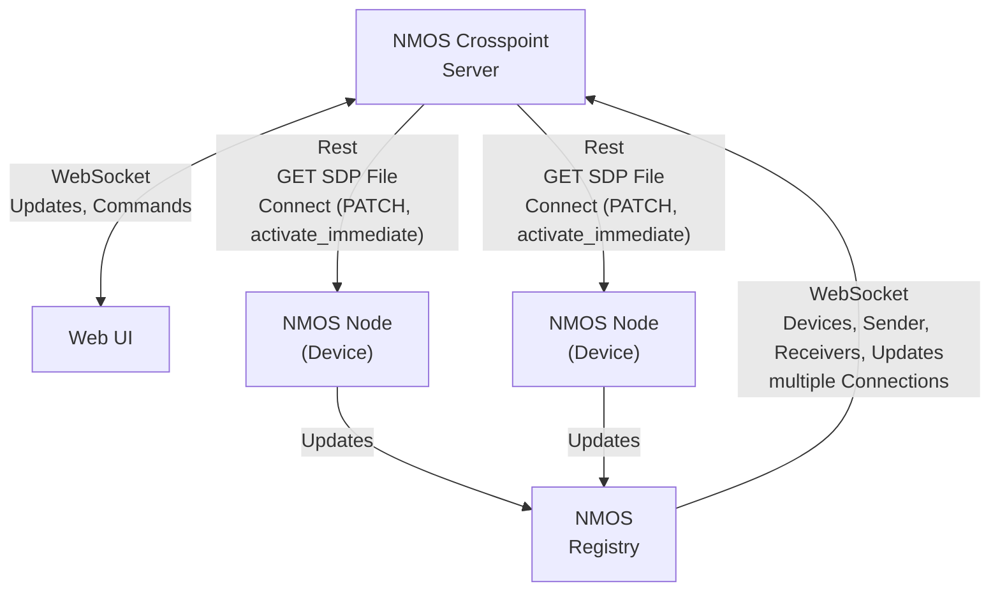

# NMOS Crosspoint

This tool is intended as a simple Orchestration layer for NMOS and ST2110 based Media Networks. 


This tool is tested against a lot of devices and now stable and performant with more than 2000 Flows.


## Features

- List of all NMOS Devices and Flows in the Network
- Multicast DHCP
- Connecting Flows to Receivers (Crosspoint style)
- Reconnect on flow changes
- DNS integration

## Planned features

- Virtual senders and receivers
- IS-07 ( Connecting WebSocket Data Streams is already working with easy-nmos-node )
- IS-08 ( Work in progress)
- BCP-008
- IS-13

## TODO


## Dependencies

This tool needs a working NMOS Registry running in the network. We test against [nmos-cpp](https://github.com/sony/nmos-cpp) in a docker container.

To get one up and running, you can use the one provided by rhastie: [https://github.com/rhastie/build-nmos-cpp](https://github.com/rhastie/build-nmos-cpp)

## Configuration


## Installation

The simplest way to get NMOS Crosspoint up and running is to use Docker Compose.


```shell
docker-compose up
```
This will create and start one Docker Container with a node express server.
Just point your Browser to the IP of the created Docker Container at port 80

## Just run it !

If you have a NMOS Registry in the network (Easy-NMOS for example) you can just start this tool on any computer.

## Network


## How it works




## Development

```
docker-compose up nmos-crosspoint-dev
```
Will start one Docker Container with a live updating Node Server.
For both folders, `/ui` and `/server` you could also run `npm install` and `npm run dev` for a local development session. 

In development mode it is extremely usefull for debugging as you can nearly live modify patch commands and the interpretation of NMOS data. under `http://<ip:port>/debug` you can see the full live updating crosspoint and NMOS data. Under `http://<ip:port>/log` there is lots of usefull data while making connections.

## Standalone
