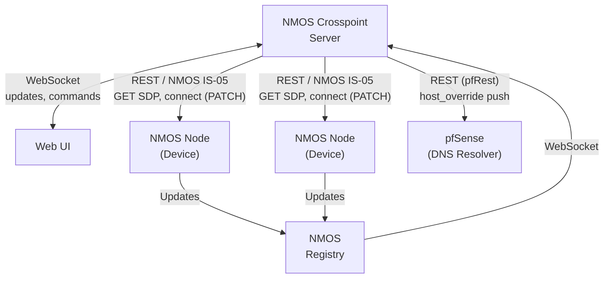

# NMOS Crosspoint

NMOS Crosspoint is a web-based control panel for **NMOS** and **ST 2110** media networks. It shows every device on your network, lets you route senders to receivers like a classic crosspoint, takes care of multicast addresses for you, and keeps things tidy with little touches like vendor-specific Web-UI links, DNS hostname registration and PTP health hints.


Tested with a wide range of devices — Lawo, Riedel, Embrionix, AJA, Imagine, Sony, Grass Valley, Blackmagic, Merging Anubis / Hapi / Horus, DirectOut, QSC, Matrox — and stable with more than 2000 flows.


## What it does

- **Crosspoint matrix.** Click a sender and a receiver to connect them. Optional Autotake or "stage and then TAKE" workflow.
- **Multicast DHCP.** Hands out and tracks multicast addresses automatically from a pool you define. No more spreadsheets.
- **Live device overview.** Every node, device, sender and receiver from the NMOS registry, in real time. Status dots show whether a device is online and locked to your house PTP.
- **Forget and Hide.** Remove offline devices or individual offline senders / receivers; hide flows you don't want to see in the matrix without losing the device.
- **Vendor Web-UI links.** One click opens the device's own configuration page in a new tab — the URL is built from a vendor recipe so it works the same across Matrox, Embrionix, Merging, QSC, Sony and the rest.
- **DNS hostname push.** Each device's name lands as a `host_override` on your pfSense DNS resolver, so `Camera1.simplexity.training` resolves automatically.
- **Aliases.** Rename a device or a single flow to whatever your operators call it; the original NMOS label is still visible as a tooltip.
- **PTP health.** Tell Crosspoint which Grand-Master ID is the "correct" one and every device shows a green / yellow / red dot at a glance.
- **Search and filter.** Find a device or flow by name, format, codec or IP.


## The Setup page

The Setup page is where everything is configured. Each section in short:

**NMOS Registry, Acceptable PTP GMID, Receiver Auto-Reconnect**
The top of the Setup page. Tell Crosspoint which NMOS registry to talk to (changing this needs a server restart), which Grand-Master ID counts as "right" (devices locked to it get a green dot on the Details page, others a yellow one), and whether receivers should re-execute when a sender's SDP changes (off by default — many devices renegotiate on their own).


**Crosspoint: Auto-Activate Sender + Multicast DHCP**
Auto-Activate Sender, off by default, automatically switches on an inactive sender when you patch a receiver to it. Multicast DHCP is the main switch for the address pool — when enabled, every active sender gets a reserved pair of addresses (odd / odd+1 so ST 2022-7 works) drawn from a single CIDR range you define (default `239.30.0.0/16`). When you flip it on for the first time you're asked whether to **Keep current IPs** (no streams touched) or **Renew from Pool** (everything gets a fresh address).


**Lease Inventory**
Every multicast allocation is listed with live status (active / inactive / missing), category badge (audio / video), bitrate and allocation date. One-click release per row, or "Release all leases" to start fresh. The list can also be exported and imported as JSON.


**Device Web UI Link Setup**
Per-vendor recipes for the "Open device Web UI" link on the Details page. Profiles match by substring against the NMOS node label (first match wins). Defaults ship for Matrox, Embrionix, Riedel, Lawo, AJA, Imagine, Sony, Grass Valley, Blackmagic, Merging, DirectOut and QSC. A "detected devices" list right below the table shows the resulting URL for every node so you can sanity-check your recipe. Profiles can be exported / imported as JSON.


**Push Names to DNS**
Publish every device's name as a DNS entry on your pfSense Unbound resolver via the [pfRest](https://pfrest.org) API. Manual DNS entries on the same server are never touched — Crosspoint tags everything it owns. Forgetting a device also removes its DNS entry.


**Change Login & Password**
Update your admin user and password. You can only edit your own account and you have to know the current password. After a change the server logs you out and asks you to sign in again with the new credentials.


## Day-to-day usage

- **Connect** — open Crosspoint, click a sender, click a receiver, done. With Autotake off you collect changes first and press TAKE to apply them all at once.
- **Inspect a device** — Details page shows every flow, the live legs (IPs and ports), the SDP-derived format and bitrate, and lets you edit the alias or the multicast IP per leg.
- **Replace a device** — Forget the old one (releases its multicast leases, removes its DNS entry). Plug the new one in. It'll show up automatically.
- **Spot a problem** — the right-hand nav has a live Dev / TX / RX counter that goes yellow / red when something becomes unreachable, visible from every page.


## What you need

A working NMOS Registry on the network. Crosspoint is tested against [nmos-cpp](https://github.com/sony/nmos-cpp).

If you don't have one yet, the ready-made image from rhastie is a fast way to get started: [github.com/rhastie/build-nmos-cpp](https://github.com/rhastie/build-nmos-cpp).


## Installation

```shell
docker-compose up
```

That starts the Crosspoint container. Point a browser at the host IP on port 80.

`docker-compose.yml` mounts two persistent folders, so your settings and lease history survive container rebuilds:

| Path                    | What's in it                                                          |
| ----------------------- | --------------------------------------------------------------------- |
| `./server/config`       | `settings.json` (registry, multicast pool, vendor profiles, DNS Push, …) and `users.json`. |
| `./server/state`        | Multicast lease history, crosspoint shadow, hidden-flag list.         |

The default account is `admin / admin`. Change it from Setup → "Change Login & Password" on first run.


## How it fits together




## Planned

- Virtual senders and receivers
- IS-07 (works today with easy-nmos-node)
- IS-08 (in progress)
- BCP-008
- IS-13


## Development

```shell
docker-compose up nmos-crosspoint-dev
```

Live-reloading Node server. Alternatively, in `/server` and `/ui` run `npm install && npm run dev` for a local session.

The debug routes `http://<host>/debug` (full live state) and `http://<host>/log` (server log stream) are useful when tracing connection or patch behaviour.

